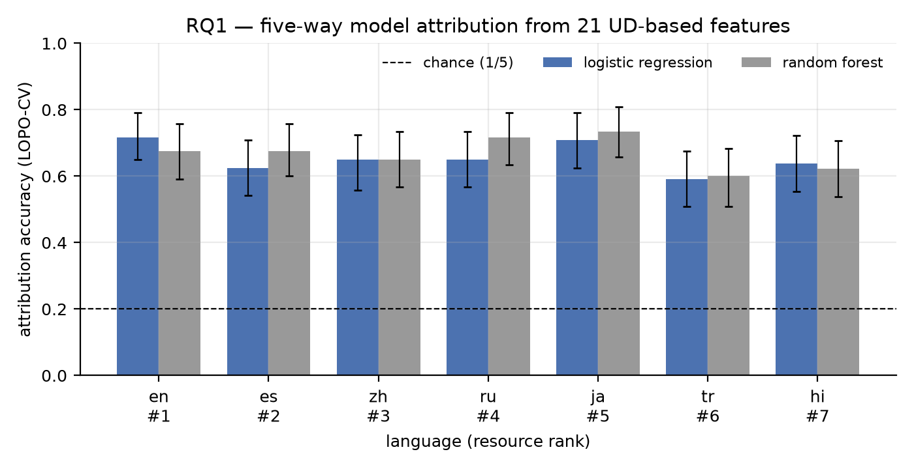
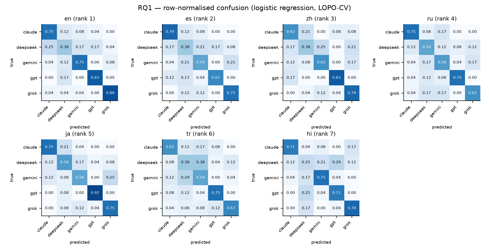
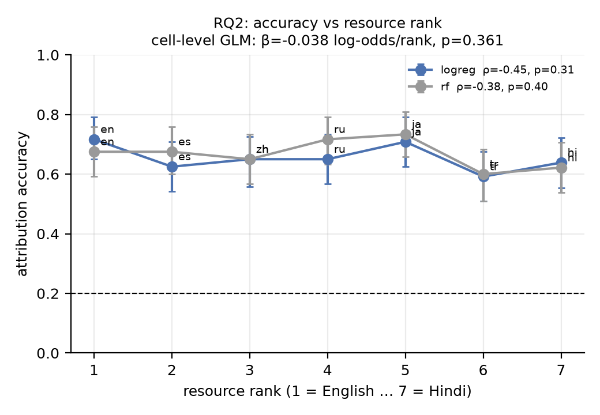
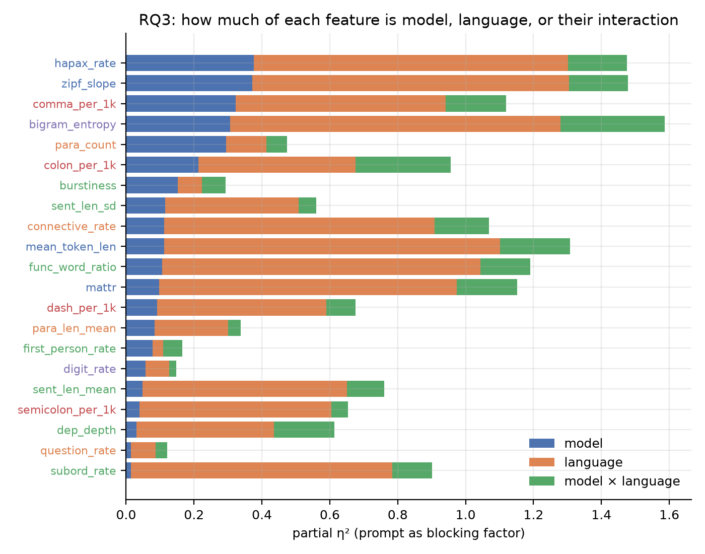
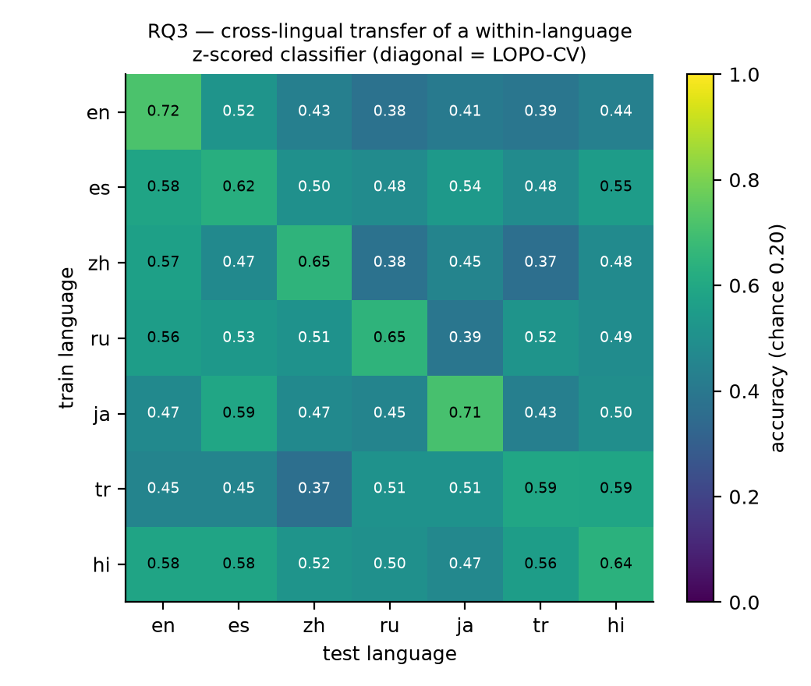
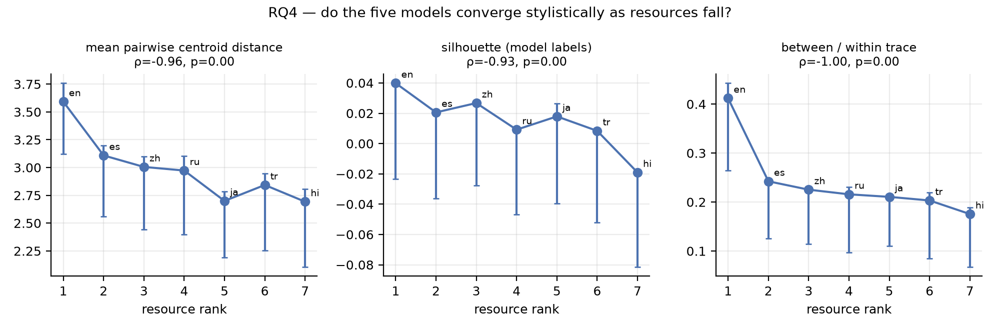
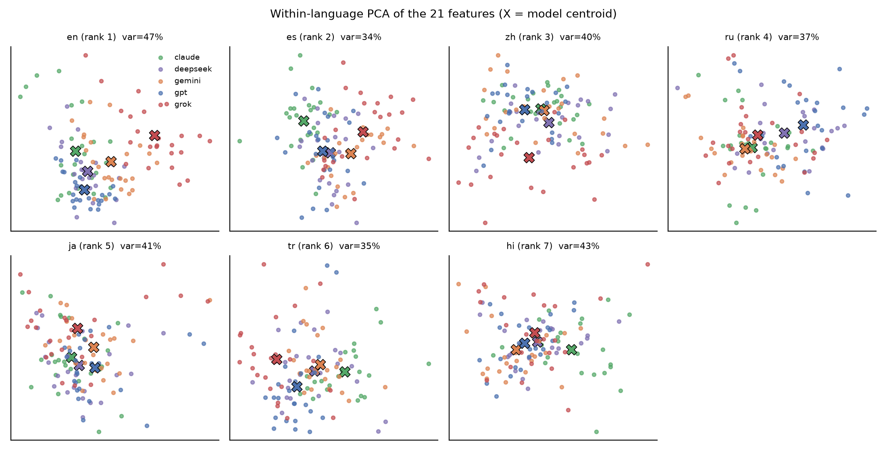
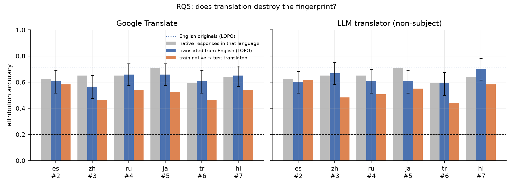
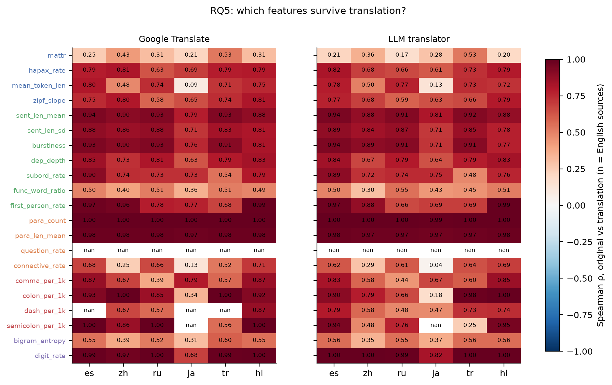

# LangLLM — Methodology and Results

*Do LLM stylistic fingerprints survive outside English?* Interpretable stylometric attribution of
five frontier models across a seven-language resource gradient. Repository:
https://github.com/adrian-erlikhman/LangLLM

**Summary.** Five frontier models can be told apart from 21 interpretable, language-comparable
features in every one of seven languages, at 59–72% five-way accuracy against 20% chance
(logistic regression, leave-one-prompt-out; every 95% CI excludes chance). Contrary to the
hypothesis, attribution accuracy does **not** fall along the resource gradient: Japanese is as
identifiable as English, Hindi and Turkish sit within a few points of Spanish, and the cell-level
gradient coefficient is small and non-significant. Language explains far more feature variance
than model does (mean partial η² 0.54 vs 0.15), yet the model fingerprint is substantially
language-invariant: a classifier trained on one language and tested on another, after removing
each language's mean, is above chance in all 42 language pairs (mean 0.49). Models **do**
converge stylistically as resources fall: the multivariate separation between model centroids
shrinks monotonically from English to Hindi (Spearman ρ = −0.96, p < 0.001), driven mostly by
Grok, the outlier in English, drifting toward the pack. The apparent paradox, convergence
without loss of attribution, resolves as follows: models converge in the bulk of features while
a few high-signal features (paragraph count, comma and colon rates, lexical-diversity slope)
keep separating them. Finally, translation does **not** destroy the fingerprint: after Google
Translate or a free non-subject LLM renders the English responses into the six other languages,
five-way attribution still runs 0.57–0.70, and an English-trained classifier reads the
translations at 0.66, because the surviving signal is structural (paragraphing, sentence rhythm,
punctuation) rather than lexical. Asked directly which model wrote a text, four of the five
models are at chance in every language (GPT names itself 82% of the time regardless of
author; the others default to "Claude"); only Claude is above chance (25.4%, p < 0.001) with
a genuine, if small, self-recognition signal (own-text recall 17% vs 7% false claims) that is
strongest in Hindi, not weakest. Interpretable features beat every LLM judge by 35 to 50
points in every language.

## 1. Design

| | |
|---|---|
| Subject models | gpt = `openai/gpt-5.5` · gemini = `google/gemini-3.5-flash` · claude = `anthropic/claude-opus-4.7` · grok = `x-ai/grok-4.3` · deepseek = `deepseek/deepseek-v4-pro-0813` |
| Languages (resource rank) | English (1) → Spanish (2) → Chinese (3) → Russian (4) → Japanese (5) → Turkish (6) → Hindi (7) |
| Cells | 5 models × 12 prompts × 7 languages × 2 generations = 840 responses |
| Prompt writer | `meta-llama/llama-4-maverick` (not a subject) |
| Prompt reviewer | `qwen/qwen3.7-plus` (not a subject, third family) |
| Translators (RQ5) | Google Translate (web endpoint); `minimax/minimax-m3:free` with fallbacks ['nvidia/nemotron-3-super-120b-a12b:free', 'meta-llama/llama-4-maverick'] |
| Generation | single user turn, no system prompt, temperature 0.7, seeds fixed per generation index, reasoning {'effort': 'low', 'exclude': True}, 4000-token budget |

### 1.1 Prompts
Twelve English schemas each fix a topic, a stance (6 for / 6 against), three sub-claims and a
reading-level tier (4 general / 4 educated / 4 expert). The tier is a prompt control only:
Flesch–Kincaid is English-specific, so no readability feature is measured. For every language
the prompt writer composes a native prompt *from the schema*, never by translation. All seven
versions of a prompt share topic, stance and sub-claims, so content is held fixed and only style
is free. Every native prompt was then checked blind by the reviewer model, which extracted
topic, stance and supporting points and matched them to the schema; failing prompts were
regenerated with the reviewer's note as feedback until all 84 passed (`prompts/native/REVIEW.md`;
earlier wordings are retained in each prompt record).

### 1.2 Validation
Language identification (lingua, restricted to the seven languages, confidence ≥ 0.6), a
word-equivalent length window of 150–900 (Chinese and Japanese converted from characters), a
per-language refusal heuristic, truncation, and a count of heading/bullet lines. Exclusion
rates are reported per model × language (§2).

### 1.3 Features
All text is parsed with Stanza (Universal Dependencies: tokenize, pos, lemma, depparse), so every
feature has the same definition in every language. 21 features in five groups:

| Group | Features |
|---|---|
| Lexical | MATTR (window 50), hapax rate, mean token length, Zipf slope |
| Syntactic | sentence length mean and SD, burstiness, dependency depth, subordinate-clause rate (`acl advcl ccomp xcomp csubj`), function-word ratio, first-person rate |
| Structure | paragraph count, paragraph length, question rate, connective rate (`cc`, `mark`, sentence-initial ADV/CCONJ/SCONJ) |
| Punctuation | comma, colon, dash, semicolon per 1 000 tokens, with script equivalents mapped (`，、` `：` `— – ―` `；`) |
| Character | character-bigram entropy, digit rate |

English-only measures (Flesch, Fog, hedges, passive rate, contractions) are excluded. Chinese and
Japanese are pre-split on `。！？` because Stanza's splitter does not handle them.

### 1.4 Analysis
* **RQ1** — per language, five-way attribution with leave-one-prompt-out cross-validation (both
  generations of a prompt stay on the same side of the split). Primary classifier: multinomial
  logistic regression on standardised features (interpretable); random forest as a ceiling.
  Chance = 0.20. 95% bootstrap CIs; exact binomial test against chance.
* **RQ2** — Spearman ρ of accuracy against resource rank (n = 7) and a cell-level binomial GLM
  `correct ~ rank` with prompt-clustered standard errors (n = all cells). Robustness: features
  residualised on log length within language.
* **RQ3** — per feature, two-way ANOVA (model × language, prompt as blocking factor) with partial
  η²; and a cross-lingual transfer matrix: a classifier trained on within-language z-scored
  features of language A, tested on language B.
* **RQ4** — within-language model separation after pooled z-scoring: mean pairwise centroid
  distance, silhouette of model labels, between/within scatter ratio; stratified bootstrap
  (reflected) CIs; Spearman against rank.
* **RQ5** (extension suggested by Philo) — every kept English response translated into the six
  other languages by two translators. T1: attribution on translated text alone; T2: a classifier
  trained on *native* responses in the target language applied to the translations, and one
  trained on the English originals; T3: per-feature Spearman ρ between original and translation.

Full pre-specified decision rules: `docs/analysis_plan.md`.


## 2. Data quality

Keep rate per model × language (1.00 = all 24 responses usable):

| model_key | en | es | zh | ru | ja | tr | hi |
|---|---|---|---|---|---|---|---|
| claude | 1.00 | 1.00 | 1.00 | 1.00 | 1.00 | 1.00 | 1.00 |
| deepseek | 1.00 | 1.00 | 1.00 | 1.00 | 1.00 | 1.00 | 1.00 |
| gemini | 1.00 | 1.00 | 1.00 | 1.00 | 1.00 | 1.00 | 1.00 |
| gpt | 1.00 | 1.00 | 1.00 | 1.00 | 1.00 | 1.00 | 1.00 |
| grok | 1.00 | 1.00 | 1.00 | 1.00 | 1.00 | 1.00 | 0.96 |


Cells with any exclusion:

| model_key | lang | n | wrong_language_rate | refusal_rate | error_rate | truncated_rate | too_short_rate | too_long_rate |
|---|---|---|---|---|---|---|---|---|
| grok | hi | 24 | 0.04 | 0.00 | 0.00 | 0.00 | 0.00 | 0.00 |


Median length (word-equivalents):

| model_key | en | es | zh | ru | ja | tr | hi |
|---|---|---|---|---|---|---|---|
| claude | 354 | 366 | 574 | 338 | 382 | 320 | 382 |
| deepseek | 354 | 373 | 471 | 324 | 406 | 322 | 386 |
| gemini | 333 | 352 | 433 | 308 | 334 | 292 | 390 |
| gpt | 414 | 414 | 586 | 372 | 396 | 330 | 406 |
| grok | 298 | 326 | 387 | 254 | 262 | 226 | 262 |

## 3. RQ1 — attribution within each language



| lang | rank | n | accuracy | acc_ci_lo | acc_ci_hi | macro_f1 | p_vs_chance | rf_accuracy |
|---|---|---|---|---|---|---|---|---|
| en | 1 | 120 | 0.717 | 0.650 | 0.792 | 0.711 | 0.000 | 0.675 |
| es | 2 | 120 | 0.625 | 0.542 | 0.708 | 0.625 | 0.000 | 0.675 |
| zh | 3 | 120 | 0.650 | 0.558 | 0.725 | 0.644 | 0.000 | 0.650 |
| ru | 4 | 120 | 0.650 | 0.567 | 0.733 | 0.654 | 0.000 | 0.717 |
| ja | 5 | 120 | 0.708 | 0.625 | 0.792 | 0.707 | 0.000 | 0.733 |
| tr | 6 | 120 | 0.592 | 0.508 | 0.675 | 0.596 | 0.000 | 0.600 |
| hi | 7 | 119 | 0.639 | 0.554 | 0.723 | 0.634 | 0.000 | 0.622 |



**Interpretation.** Attribution works in every language. GPT-5.5 and Grok 4.3 are the most
identifiable (typically 75–90% recall); Claude Opus 4.7 and Gemini 3.5 Flash follow; DeepSeek
V4 Pro is the blur, at 25–58% recall, most often mistaken for Claude in English and for GPT or
Gemini in Hindi. The feature-importance tables show the fingerprint is carried by *structure and
punctuation* more than syntax: paragraph count and length, comma and colon density, and the
lexical-diversity measures (hapax rate, Zipf slope, bigram entropy) dominate in almost every
language, whereas dependency depth, subordination and question rate contribute little. Length
is part of the signal: GPT-5.5 writes the longest responses and Grok the shortest in all seven
languages (§2), and the length-residualised robustness run (§4) shows the *linear* fingerprint
loses 10–20 points without it, while the random forest does not, so the residual, non-length
fingerprint is real but non-linear.


Most discriminative features per language:

| lang | top-5 features (mean |standardised coefficient|) |
|---|---|
| en | para_len_mean, subord_rate, func_word_ratio, zipf_slope, mean_token_len |
| es | colon_per_1k, comma_per_1k, first_person_rate, para_len_mean, para_count |
| zh | bigram_entropy, mattr, comma_per_1k, para_count, semicolon_per_1k |
| ru | para_count, comma_per_1k, colon_per_1k, para_len_mean, dash_per_1k |
| ja | bigram_entropy, para_count, comma_per_1k, para_len_mean, zipf_slope |
| tr | para_len_mean, para_count, connective_rate, mattr, bigram_entropy |
| hi | comma_per_1k, bigram_entropy, para_count, zipf_slope, digit_rate |

## 4. RQ2 — the resource gradient



| test | value | p |
|---|---|---|
| Spearman ρ (logreg), n=7 | -0.45 | 0.310 |
| Spearman ρ (random forest) | -0.38 | 0.403 |
| OLS slope, accuracy per rank step | -0.009 | 0.348 |
| Cell-level GLM β(rank), log-odds, n=839, prompt-clustered | -0.038 (SE 0.042) | 3.61e-01 |
| GLM β(rank) with length-residualised features | -0.053 | 1.64e-01 |

**Interpretation.** The pre-registered decision rule (negative rank coefficient, p < 0.05) is
**not met**. The point estimate is negative but tiny: about −0.04 log-odds per rank step,
which is under one percentage point of accuracy per step, with p ≈ 0.36 (p ≈ 0.16 after length
control). The ordering is also not monotone: Japanese (rank 5) matches English, Hindi (rank 7)
beats Turkish (rank 6) and Spanish (rank 2). With interpretable features, the fingerprint does
not fade with training-data share; whatever these models do differently, they do it in Hindi
too. The one qualification is that our rank is ordinal and approximate; a numeric share
covariate might sharpen the picture, but the range of accuracies (0.59–0.72) leaves little
gradient to find.

## 5. RQ3 — model style vs language style



Partial η² per feature (MEAN row = average over the 21 features):

| feature | eta2_model | eta2_lang | eta2_interaction | eta2_prompt |
|---|---|---|---|---|
| hapax_rate | 0.376 | 0.927 | 0.173 | 0.257 |
| zipf_slope | 0.372 | 0.933 | 0.174 | 0.223 |
| comma_per_1k | 0.323 | 0.619 | 0.177 | 0.199 |
| bigram_entropy | 0.306 | 0.974 | 0.306 | 0.120 |
| para_count | 0.294 | 0.119 | 0.061 | 0.100 |
| colon_per_1k | 0.213 | 0.463 | 0.280 | 0.028 |
| burstiness | 0.152 | 0.071 | 0.070 | 0.078 |
| MEAN | 0.145 | 0.539 | 0.127 | 0.159 |
| sent_len_sd | 0.116 | 0.392 | 0.052 | 0.174 |
| connective_rate | 0.112 | 0.796 | 0.161 | 0.193 |
| mean_token_len | 0.112 | 0.990 | 0.206 | 0.420 |
| func_word_ratio | 0.107 | 0.937 | 0.147 | 0.263 |
| mattr | 0.098 | 0.877 | 0.178 | 0.150 |
| dash_per_1k | 0.091 | 0.498 | 0.086 | 0.067 |
| para_len_mean | 0.084 | 0.216 | 0.038 | 0.090 |
| first_person_rate | 0.078 | 0.031 | 0.057 | 0.126 |
| digit_rate | 0.057 | 0.070 | 0.020 | 0.277 |
| sent_len_mean | 0.049 | 0.601 | 0.110 | 0.151 |
| semicolon_per_1k | 0.040 | 0.564 | 0.049 | 0.079 |
| dep_depth | 0.030 | 0.406 | 0.178 | 0.083 |
| question_rate | 0.014 | 0.073 | 0.034 | 0.107 |
| subord_rate | 0.014 | 0.770 | 0.117 | 0.159 |


Cross-lingual transfer (rows = training language, columns = test language, within-language z-scored; diagonal = LOPO-CV):

| train \ test | en | es | zh | ru | ja | tr | hi |
|---|---|---|---|---|---|---|---|
| en | 0.72 | 0.52 | 0.43 | 0.38 | 0.41 | 0.39 | 0.44 |
| es | 0.58 | 0.62 | 0.50 | 0.48 | 0.54 | 0.48 | 0.55 |
| zh | 0.57 | 0.47 | 0.65 | 0.38 | 0.45 | 0.37 | 0.48 |
| ru | 0.56 | 0.53 | 0.51 | 0.65 | 0.39 | 0.52 | 0.49 |
| ja | 0.47 | 0.59 | 0.47 | 0.45 | 0.71 | 0.43 | 0.50 |
| tr | 0.45 | 0.45 | 0.37 | 0.51 | 0.51 | 0.59 | 0.59 |
| hi | 0.58 | 0.58 | 0.52 | 0.50 | 0.47 | 0.56 | 0.64 |

Mean off-diagonal accuracy 0.486 vs diagonal 0.654; 42 of 42 off-diagonal cells above chance (0.20).



**Interpretation.** Language dominates every feature that touches morphology or the lexicon:
mean token length, function-word ratio, MATTR, hapax rate and Zipf slope have language η² above
0.85, as expected when comparing Chinese characters, Turkish agglutination and Hindi
postpositions. Model effects are largest on the same lexical-diversity measures (hapax rate
0.38, Zipf slope 0.37), on comma density (0.32), bigram entropy (0.31) and paragraph count
(0.29), and smallest on subordination, question rate and dependency depth (≤ 0.03), so the
models differ in *how varied their vocabulary is and how they punctuate and paragraph*, not in
clause architecture. The interaction term is on average as large as the model term (0.13 vs
0.15), meaning each model adapts its style per language, but the transfer matrix shows the
invariant part is the larger share: after within-language standardisation, a classifier trained
on any language reaches 0.38–0.59 on any other (mean 0.49 against a within-language mean of
0.65; all 42 off-diagonal cells above chance). Roughly three quarters of within-language
performance transfers. The fingerprint is therefore mostly language-invariant with a
per-language accent.

## 6. RQ4 — convergence in low-resource languages



| lang | rank | centroid_dist | centroid_dist_ci_lo | centroid_dist_ci_hi | silhouette | silhouette_ci_lo | silhouette_ci_hi | between_within_ratio |
|---|---|---|---|---|---|---|---|---|
| en | 1 | 3.592 | 3.123 | 3.758 | 0.040 | -0.023 | 0.033 | 0.412 |
| es | 2 | 3.109 | 2.559 | 3.196 | 0.021 | -0.036 | 0.013 | 0.242 |
| zh | 3 | 3.006 | 2.441 | 3.098 | 0.027 | -0.028 | 0.025 | 0.225 |
| ru | 4 | 2.973 | 2.399 | 3.106 | 0.009 | -0.047 | 0.002 | 0.216 |
| ja | 5 | 2.700 | 2.191 | 2.784 | 0.018 | -0.039 | 0.026 | 0.211 |
| tr | 6 | 2.843 | 2.254 | 2.948 | 0.008 | -0.052 | 0.007 | 0.203 |
| hi | 7 | 2.693 | 2.105 | 2.805 | -0.019 | -0.081 | -0.019 | 0.175 |

| metric | Spearman ρ vs rank | p | English | Hindi |
|---|---|---|---|---|
| centroid_dist | -0.96 | 0.000 | 3.592 | 2.693 |
| silhouette | -0.93 | 0.003 | 0.040 | -0.019 |
| between_within_ratio | -1.00 | 0.000 | 0.412 | 0.175 |



**Interpretation.** All three separation metrics fall with rank, and all three Spearman
correlations are at or near −1 (centroid distance ρ = −0.96, p < 0.001; silhouette ρ = −0.93,
p = 0.003; between/within ratio ρ = −1.00). The between/within ratio more than halves from
English (0.41) to Hindi (0.18); the silhouette is small everywhere and negative in Hindi, so no
model forms a tight cluster in the low-resource languages. The pairwise table locates the
convergence: the two largest English distances, GPT–Grok (5.7) and DeepSeek–Grok (4.9),
collapse to 2.7 and 2.0 in Hindi, and Claude–Grok goes from 5.4 to 3.5. Grok's terse, sparsely
punctuated English register is the outlier that disappears; the other four models were never
far apart and stay that way. Convergence and sustained attribution accuracy are compatible
because the classifier needs only a handful of features to separate five classes, while the
centroid distance averages over all 21, most of which have converged. The practical reading for
register: in low-resource languages the five models write more alike than they do in English,
but not yet identically.


Pairwise centroid distances (within-language z-scored units):

| pair | en | es | zh | ru | ja | tr | hi |
|---|---|---|---|---|---|---|---|
| claude–deepseek | 2.35 | 2.73 | 1.67 | 2.92 | 1.67 | 2.42 | 2.57 |
| claude–gemini | 3.19 | 3.78 | 2.63 | 2.63 | 1.96 | 2.19 | 3.78 |
| claude–gpt | 3.49 | 3.38 | 2.50 | 3.64 | 3.18 | 3.79 | 3.58 |
| claude–grok | 5.42 | 4.15 | 3.87 | 3.33 | 3.39 | 4.32 | 3.46 |
| deepseek–gemini | 2.09 | 2.11 | 2.25 | 2.60 | 1.81 | 1.28 | 2.02 |
| deepseek–gpt | 2.14 | 2.08 | 2.81 | 2.43 | 2.63 | 2.12 | 1.41 |
| deepseek–grok | 4.86 | 2.90 | 3.01 | 2.22 | 3.30 | 3.06 | 2.02 |
| gemini–gpt | 3.14 | 3.67 | 3.75 | 3.95 | 2.76 | 2.69 | 2.44 |
| gemini–grok | 3.55 | 2.55 | 3.58 | 2.18 | 2.49 | 3.25 | 2.96 |
| gpt–grok | 5.69 | 3.75 | 3.99 | 3.83 | 3.80 | 3.32 | 2.69 |

## 7. RQ5 — does translation destroy the fingerprint?



| translator | lang | rank | n | acc_translated_lopo | ci_lo | ci_hi | acc_english_originals | acc_native_same_lang | acc_train_native_test_translated | acc_train_english_test_translated |
|---|---|---|---|---|---|---|---|---|---|---|
| google | es | 2 | 120 | 0.608 | 0.517 | 0.692 | 0.717 | 0.625 | 0.583 | 0.717 |
| google | zh | 3 | 120 | 0.567 | 0.475 | 0.650 | 0.717 | 0.650 | 0.467 | 0.633 |
| google | ru | 4 | 120 | 0.658 | 0.575 | 0.742 | 0.717 | 0.650 | 0.542 | 0.717 |
| google | ja | 5 | 120 | 0.658 | 0.575 | 0.742 | 0.717 | 0.708 | 0.525 | 0.575 |
| google | tr | 6 | 120 | 0.608 | 0.517 | 0.692 | 0.717 | 0.592 | 0.467 | 0.650 |
| google | hi | 7 | 120 | 0.650 | 0.567 | 0.725 | 0.717 | 0.639 | 0.542 | 0.692 |
| llm | es | 2 | 120 | 0.600 | 0.516 | 0.683 | 0.717 | 0.625 | 0.617 | 0.750 |
| llm | zh | 3 | 120 | 0.667 | 0.583 | 0.750 | 0.717 | 0.650 | 0.483 | 0.625 |
| llm | ru | 4 | 120 | 0.608 | 0.516 | 0.700 | 0.717 | 0.650 | 0.508 | 0.658 |
| llm | ja | 5 | 120 | 0.608 | 0.517 | 0.692 | 0.717 | 0.708 | 0.550 | 0.508 |
| llm | tr | 6 | 120 | 0.592 | 0.500 | 0.675 | 0.717 | 0.592 | 0.442 | 0.650 |
| llm | hi | 7 | 120 | 0.700 | 0.617 | 0.783 | 0.717 | 0.639 | 0.583 | 0.767 |

Summary per translator:

| translator | mean_acc_translated_lopo | acc_english_originals | mean_acc_native_same_lang | mean_acc_train_native_test_translated | mean_acc_train_english_test_translated | mean_feature_rho | features_rho_above_0.5 | mean_eta2_model_before | mean_eta2_model_after |
|---|---|---|---|---|---|---|---|---|---|
| google | 0.625 | 0.717 | 0.644 | 0.521 | 0.664 | 0.742 | 16 | 0.405 | 0.321 |
| llm | 0.629 | 0.717 | 0.644 | 0.531 | 0.660 | 0.714 | 16 | 0.405 | 0.299 |



**Interpretation.** Neither translator destroys the fingerprint. Attribution on translated
text alone runs 0.57–0.70 (mean 0.625 for Google Translate, 0.629 for the LLM translator)
against 0.717 on the English originals and a mean of 0.644 for *native* responses in the same
languages; every CI excludes chance and every binomial test has p < 0.001. Translating a text
costs about nine points of accuracy, roughly what moving from English to a native low-resource
language costs, and no more.

The English fingerprint travels intact. A classifier trained on the English originals and
applied to their translations scores 0.66 on average for both translators (0.77 for the LLM's
Hindi), essentially the English accuracy, so what a translator outputs is still recognisably
the source model's *English* style in another script. A classifier trained on the model's own
native-language responses does worse on the translations (0.52–0.53): translated GPT resembles
English GPT more than it resembles native Spanish GPT. This also answers the "which style does
the translated text carry" question: the translator preserves the source's structural habits
rather than re-styling the text into the model's native register for that language.

Feature survival explains why. Structural and rhythmic features come through almost unchanged
(Spearman ρ between original and translation, averaged over six languages): paragraph count
1.00, paragraph length 0.98, digit rate 0.94–0.97, sentence length 0.89, burstiness 0.87,
first-person rate 0.82–0.86, colon rate 0.75–0.84, sentence-length SD 0.83, dependency depth
0.77, subordination 0.72–0.74. Lexical features are rewritten by the target language: MATTR
0.29–0.34, function-word ratio 0.46, bigram entropy 0.48, connective rate 0.49. Sixteen of the
twenty measurable features keep ρ > 0.5 under both translators. The share of feature variance
explained by model falls from 0.40 in the English sources to 0.32 (Google) and 0.30 (LLM) after
translation, a reduction, not an erasure. Question rate is undefined because these essays
contain no questions.

Google Translate and the LLM translator behave almost identically. The one visible difference
is punctuation: the LLM normalises semicolons and colons more (ρ 0.68 vs 0.88, 0.75 vs 0.84),
consistent with an LLM lightly imposing its own conventions, yet its translations are, if
anything, marginally *more* attributable. A free non-subject LLM therefore does not overwrite
the source fingerprint with its own. For provenance work the practical reading is that
translation is not an effective laundering step against interpretable features, and that a
classifier trained in English can be applied across a translation boundary without retraining.


Mean Spearman ρ between original and translation, per feature (averaged over the six target languages):

| feature | google | llm |
|---|---|---|
| para_count | 1.00 | 1.00 |
| para_len_mean | 0.98 | 0.98 |
| digit_rate | 0.94 | 0.97 |
| sent_len_mean | 0.89 | 0.89 |
| semicolon_per_1k | 0.88 | 0.68 |
| burstiness | 0.87 | 0.86 |
| first_person_rate | 0.86 | 0.82 |
| colon_per_1k | 0.84 | 0.75 |
| sent_len_sd | 0.83 | 0.82 |
| dep_depth | 0.77 | 0.76 |
| hapax_rate | 0.75 | 0.72 |
| subord_rate | 0.74 | 0.72 |
| zipf_slope | 0.72 | 0.69 |
| dash_per_1k | 0.70 | 0.63 |
| comma_per_1k | 0.69 | 0.66 |
| mean_token_len | 0.60 | 0.61 |
| connective_rate | 0.49 | 0.48 |
| bigram_entropy | 0.48 | 0.49 |
| func_word_ratio | 0.46 | 0.46 |
| mattr | 0.34 | 0.29 |
| question_rate |  |  |

## 8. Limitations

* **One prompt family.** Twelve persuasive-essay schemas with a fixed three-point structure.
  The paragraph-count and connective features that carry much of the fingerprint are partly a
  property of how each model handles that instruction; other genres may fingerprint differently.
* **Length is entangled with style.** Models differ systematically in length and the linear
  classifier uses it. The length-residualised run keeps attribution well above chance
  (non-linearly), but a deployment classifier should treat length as a feature to justify, not
  a given.
* **Resource rank is ordinal.** The gradient test has seven points; the cell-level GLM adds
  power but inherits the same coarse covariate.
* **Reasoning budgets.** Ten DeepSeek cells overflowed a 4 000-token budget with hidden
  reasoning and were re-collected at 16 000; the override is recorded per response. One Grok
  response to a Hindi prompt came back in English and was excluded. 839 of 840 cells are used.
* **Two generations per cell.** Within-cell variance is estimated from n = 2; the leave-one-prompt-
  out design prevents leakage but confidence intervals are correspondingly wide (±7–9 points).
* **Automated prompt review.** Prompt fidelity was checked by a model, not a person, in all seven
  languages. The review and every regenerated wording are versioned for audit.
* **Judge condition.** RQ6 disables hidden reasoning for the four judges that allow it
  (instant-answer condition); Gemini keeps low-effort reasoning. A reasoning-on condition was
  piloted and abandoned for cost; it may raise judge accuracy and should be tested before
  claiming that LLM judges *cannot* attribute.
* **Snapshot.** Model strings are dated snapshots served through OpenRouter in September 2026;
  fingerprints will drift with model updates.

## 9. Reproduction

```
pip install -r requirements.txt && cp .env.example .env   # add OpenRouter key
python -m langllm.prompts && python -m langllm.review && python -m langllm.refine
python -m langllm.collect && python -m langllm.validate && python -m langllm.features
python -m langllm.analysis && python -m langllm.figures
python -m langllm.translate && python -m langllm.features --translated
python -m langllm.analysis_translation && python -m langllm.figures --rq5
```

Raw responses (`data/raw/`), translations (`data/translated/`), features and every result table are versioned in the repository.
